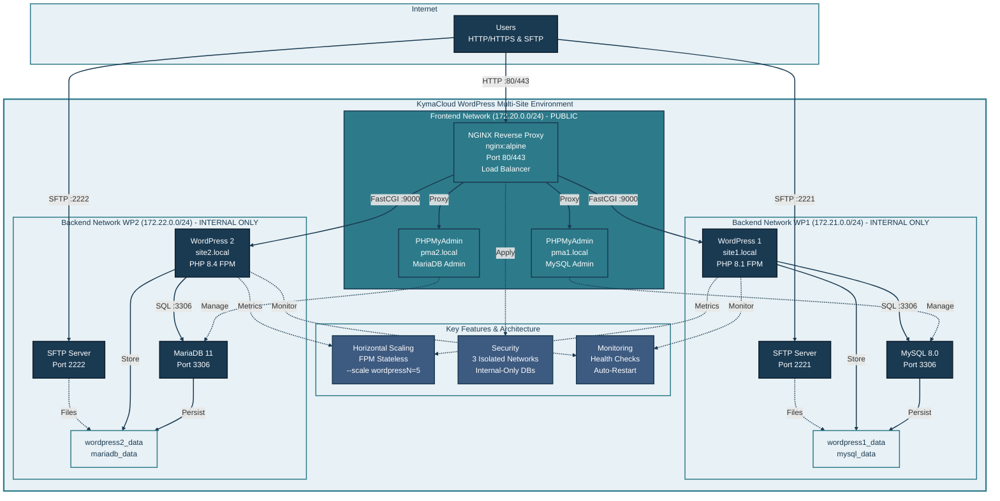

# KymaCloud WordPress Multi-Site Environment

**[ Read Full Technical Documentation](https://gatete.hashnode.dev/kymacloud-wordpress-multi-site-environment-technical-documentation)**


Production-ready Docker Compose setup for hosting multiple WordPress sites with different PHP versions, isolated databases, and comprehensive security.

## Project Structure
```
.
├── docker-compose.yml          # Main orchestration file
├── .env.example                # Environment variables template
├── .gitignore                  # Git exclusions
├── setup.sh                    # Initial setup and password generation
├── Makefile                    # Management commands
├── README.md                   
├── QUICKSTART.md               # Quick setup guide
├── nginx/
│   ├── nginx.conf             # Main NGINX configuration
│   └── conf.d/
│       ├── site1.conf         # WordPress 1 virtual host
│       ├── site2.conf         # WordPress 2 virtual host
│       └── phpmyadmin.conf    # PHPMyAdmin proxy configuration
├── php/
│   ├── php8.1.ini             # PHP 8.1 settings (OPcache, limits)
│   └── php8.4.ini             # PHP 8.4 settings (OPcache + JIT)
├── mysql/
│   └── my.cnf                 # MySQL 8.0 configuration
├── mariadb/
│   └── my.cnf                 # MariaDB 11 configuration
├── sftp/
│   ├── wp1/
│   │   ├── ssh_host_ed25519_key
│   │   ├── ssh_host_ed25519_key.pub
│   │   ├── ssh_host_rsa_key
│   │   └── ssh_host_rsa_key.pub
│   └── wp2/
│       ├── ssh_host_ed25519_key
│       ├── ssh_host_ed25519_key.pub
│       ├── ssh_host_rsa_key
│       └── ssh_host_rsa_key.pub
├── scripts/
│   └── security-check.sh      # Security validation script
├── backups/                   # Backup storage (gitignored)
│   ├── mysql/
│   ├── mariadb/
│   ├── wordpress1/
│   └── wordpress2/
└── certbot/                   # SSL certificates (gitignored)
    ├── conf/
    └── www/
```


## System Design


## Summary

This Docker Compose setup provides a complete multi-site WordPress hosting environment with:

**Infrastructure:**
- NGINX reverse proxy with custom configurations for two sites
- Two WordPress installations running different PHP versions (8.1 and 8.4)
- Separate databases: MySQL 8.0 for WordPress 1, MariaDB 11 for WordPress 2
- PHPMyAdmin interface for each database
- SFTP access for file management on each site

**Architecture Highlights:**
- Three isolated networks (frontend + two backend networks)
- Horizontal scaling capability via PHP-FPM architecture
- Production-ready configurations for NGINX, PHP, MySQL, and MariaDB
- Complete stack isolation - compromising one site doesn't affect the other
- Resource limits and health checks for stability
- Security features including rate limiting, internal networks, and restricted PHP functions

**Evaluation Criteria Addressed:**
- Networks: 3 isolated networks with internal-only database access
- Scaling: Stateless design enables horizontal scaling with single command
- Settings: Optimized configurations for all components
- Isolation: Separate networks, databases, volumes, and users per stack
- Stability: Health checks, restart policies, resource limits, binary logs
- Security: Multiple layers including network isolation, rate limiting, security headers
- Cost-effectiveness: Alpine images, shared NGINX, efficient resource allocation

## Quick Start
```bash
# 1. Run setup to generate secure passwords
chmod +x setup.sh && ./setup.sh

# 2. Start services
docker-compose up -d

# 3. Add to /etc/hosts for local testing
echo "127.0.0.1 site1.local site2.local pma1.local pma2.local" | sudo tee -a /etc/hosts
```

## Access Points

- Site 1: http://site1.local
- Site 2: http://site2.local  
- PHPMyAdmin MySQL: http://pma1.local
- PHPMyAdmin MariaDB: http://pma2.local
- SFTP Site 1: port 2221
- SFTP Site 2: port 2222

## Management
```bash
docker-compose ps              # Check status
docker-compose logs -f         # View logs
docker-compose restart         # Restart all
docker-compose up -d --scale wordpress1=3  # Scale horizontally
docker stats                   # Resource usage
```

## Security Notes

- Passwords are auto-generated by `setup.sh` and stored securely
- All sensitive files (passwords, SSH keys, backups) are excluded from git
- `.env.example` provides a template for new environments
- File permissions automatically set to 600 for secrets
- Run `./scripts/security-check.sh` to verify security configuration

## Troubleshooting

### Regenerating Passwords

If you need to regenerate passwords after containers are already running:
```bash
# 1. Remove old SSH keys
rm -f sftp/wp1/ssh_host_* sftp/wp2/ssh_host_*

# 2. Run setup to generate new passwords
./setup.sh

# 3. Stop all containers
docker-compose down

# 4. Remove WordPress volumes (contains old passwords)
docker volume rm kymacloud_mysql_data kymacloud_mariadb_data kymacloud_wordpress1_data kymacloud_wordpress2_data

# 5. Start fresh with new passwords
docker-compose up -d

# 6. Wait for containers to be healthy
docker-compose ps
```

### Common Issues

**Database connection errors:**
- WordPress volumes may contain old passwords
- Solution: Remove volumes and restart (see above)

**SSH key generation hangs:**
- Keys already exist and prompting to overwrite
- Solution: Remove existing keys first: `rm -f sftp/*/ssh_host_*`

**Containers showing unhealthy:**
- Wait 1-2 minutes for databases to initialize
- Check logs: `docker-compose logs [service-name]`

---

